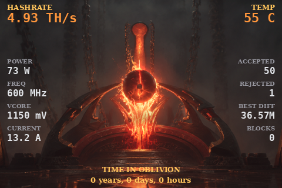
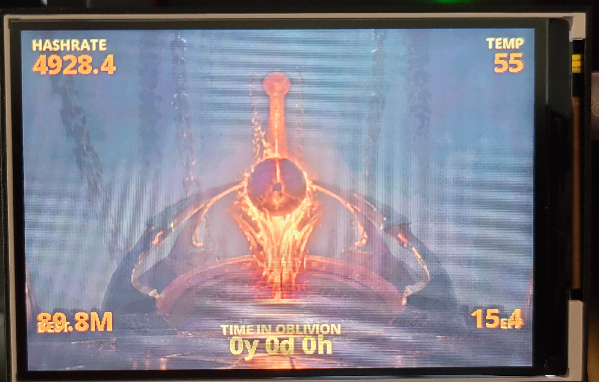
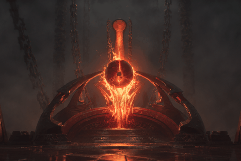
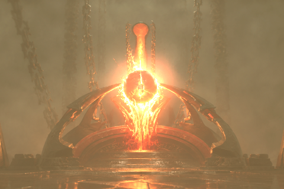

# NerdQAxe-Dagon

A **Mehrunes-Dagon-adjacent** themed firmware for the **NerdQAxe++** (BM1370)
Bitcoin solo miner — an Oblivion-like molten-fire aesthetic with an animated lava
sigil-altar mining screen, a lifetime uptime counter (labeled `TIME IN OBLIVION`
on the device), and a block-found climax overlay.

> This is an independent fan project *inspired by* the look and feel of
> *The Elder Scrolls IV: Oblivion* — not affiliated with or endorsed by its
> rights holders. See [License](#license).



> **This is a fork** of [**shufps/ESP-Miner-NerdQAxePlus**](https://github.com/shufps/ESP-Miner-NerdQAxePlus).
> All of the mining, stratum, and hardware-driver work is theirs. This fork adds
> a custom display theme and a fix for a specific big-screen panel variant
> (below). Licensed **GPLv3**, same as upstream — see [`LICENSE`](LICENSE).

From a bricked box to a custom, source-built altar — the brick, the color-space
debugging, and every fix are written up in
[`TROUBLESHOOTING.md`](TROUBLESHOOTING.md).

## What I ran into (short version)

My unit is the **big-screen** variant (3.5" 480×320 ST7796) sold on AliExpress.
The path here was the hard way:

1. **OTA-flashed the stock release** (`esp-miner.bin` + `www.bin`) from the
   upstream [Releases](https://github.com/shufps/ESP-Miner-NerdQAxePlus/releases)
   page — and it **bricked into a boot loop**, because that firmware drives the
   small 1.9" panel and the wrong display init wedges at boot.
2. **Recovered over USB** and grabbed the seller's (yysluping's) factory binary
   to identify the actual panel — they ship a binary only, no source.
3. **Rebuilt from upstream source** and fixed the display: ST7796 driver,
   480×320 geometry, BGR order, and the `LV_COLOR_16_SWAP` / big-endian RGB565
   byte-order fix (the "everything is blue" bug).
4. **Added** the Mehrunes-Dagon-adjacent theme and the persistent uptime
   counter on top.

The full play-by-play — including the grey-ramp color-debugging trick and the
brick-recovery commands — is in [`TROUBLESHOOTING.md`](TROUBLESHOOTING.md).

---

## ⚠️ Hardware caveat — read this first

This firmware is built and tested for the **3.5" 480×320 ST7796** parallel-LCD
variant of the NerdQAxe++ (the "big screen" units sold on AliExpress, e.g. by the
seller *yysluping*). Stock NerdQAxe firmware is hardcoded for the small **1.9"
T-Display S3** panel, so on these big-screen units the stock display renders
small, shifted, and color-wrong.

- **If you have the big 3.5" 480×320 ST7796 panel** → this firmware is for you.
- **If you have the stock small 1.9" panel** → use
  [upstream](https://github.com/shufps/ESP-Miner-NerdQAxePlus) instead; the Dagon
  theme is sized for 480×320 and will look wrong on the small display.

Don't know which you have? See the panel-identification notes in
[`TROUBLESHOOTING.md`](TROUBLESHOOTING.md).

Board target for this firmware: **`NERDQAXEPLUS2`** (deviceModel `NerdQAxe++`).

---

## What's different from upstream

- **ST7796 big-screen panel support** — 480×320, correct gap/mirror/byte-order
  (`esp_lcd_st7796`, `LV_COLOR_16_SWAP`, big-endian RGB565 theme assets).
- **Mehrunes-Dagon-adjacent mining screen** — animated lava sigil-altar, themed
  gold stat corners (hashrate / temp / best / efficiency), molten framing and runes.
- **Lifetime uptime counter** (labeled `TIME IN OBLIVION` on the device) —
  cumulative uptime, persisted in NVS across reboots and reconnects.
- **Block-found climax** — a full-screen "SIGIL FOUND" overlay when a block is
  solved; blocks count persists in NVS.

The mining/pool/driver internals are unchanged from upstream.

## Gallery







## Overclocking

The BM1370s have headroom. The firmware exposes the full safe frequency/voltage
range so you can tune live from the web UI; the boot default stays conservative.

| Setting | Value |
| --- | --- |
| Boot default | 600 MHz · 1150 mV · ~4.8 TH/s |
| Exposed range | 500–800 MHz · 1100–1400 mV |
| Stable overclock | 700 MHz · 1280 mV · ~5.7 TH/s · 0 rejects |
| Cooling | PID auto-fan, 55 °C target · 70 °C cutoff |

---

## Build

Build is Docker-only (no native ESP-IDF install needed). ESP-IDF v5.3.x.

```bash
# once: build the toolchain container
cd docker
./build_docker.sh
cd ..

# set the board and target
export BOARD="NERDQAXEPLUS2"
./docker/idf.sh set-target esp32s3

# after each source change
./docker/idf.sh build
```

Outputs `build/esp-miner.bin` (the app) and `build/www.bin` (the web UI).

The fuller upstream build/flash recipes (idf-shell, manual partition merge,
`bitaxetool` factory flashing, Grafana/Influx monitoring) still apply — see
[upstream's README](https://github.com/shufps/ESP-Miner-NerdQAxePlus) and the
[`monitoring/`](monitoring) directory.

## Flash

Easiest first-time flash is a **factory image** over USB. Incremental dev flashes
just the app partition. Both — plus the **brick-recovery** procedure (the device
drops to AP mode `NerdAxe_XXXX` / `192.168.4.1` after a full erase) — are
documented step-by-step in [`TROUBLESHOOTING.md`](TROUBLESHOOTING.md).

> Prebuilt binaries are attached to this repo's
> [Releases](../../releases), not committed to the tree.

---

## Theme tooling

The Dagon theme art is generated by the Python scripts at the repo root (Pillow +
numpy). Run them **from the repo root**:

| Script | What it does |
| --- | --- |
| `theme_dagon_gen.py` | Procedural molten background + stat-layout preview |
| `theme_dagon_img.py` | Theme using your own lava-fields source art (`art/…`) |
| `theme_mockup.py` / `dagon_target.py` | Layout mockups for iterating before flashing |
| `convert_le.py` | **RGB565 big-endian encoder** — the repo's stock converter writes the wrong byte order for `LV_COLOR_16_SWAP=1`; use this one |

Outputs land in `theme_build/` (gitignored, regenerated). The byte-order story —
and why you debug display color with a grey ramp, not a flat color — is in
[`TROUBLESHOOTING.md`](TROUBLESHOOTING.md).

---

## Sources & provenance

This is a small theme/display fork sitting on top of other people's work. The
lineage, newest to oldest:

| Layer | Project | Role |
| --- | --- | --- |
| This repo | **nerdqaxe-dagon** | Dagon theme + ST7796 480×320 fix only |
| Direct upstream | [**shufps/ESP-Miner-NerdQAxePlus**](https://github.com/shufps/ESP-Miner-NerdQAxePlus) ([Releases](https://github.com/shufps/ESP-Miner-NerdQAxePlus/releases)) | The actual miner firmware. **The `esp-miner.bin` / `www.bin` I flashed came from its Releases page.** |
| Root firmware | [**BitAxe ESP-Miner**](https://github.com/bitaxeorg/ESP-Miner) (@skot / @ben / @jhonny) and NerdAxe (@BitMaker) | The original ESP-Miner the whole family descends from |
| Hardware / panel | **yysluping** (AliExpress seller) | Source of the 3.5" big-screen NerdQAxe++ and the proprietary factory binary used to identify the panel |

### What this repo does and does NOT host

- ✅ It contains shufps's GPLv3 firmware source **plus my changes** — a GPLv3
  derivative, which is exactly what that license permits, with attribution above.
- ❌ It does **not** redistribute shufps's release binaries — get those from
  their [Releases](https://github.com/shufps/ESP-Miner-NerdQAxePlus/releases).
- ❌ It does **not** contain yysluping's proprietary factory binary or anyone
  else's prebuilt image. If you need the seller's stock binary, get it from the
  seller. The only binaries I publish here are ones built from this GPLv3 source.

## License

Licensed under **GPLv3** ([`LICENSE`](LICENSE)), same as upstream — it cannot be
relicensed.

This is an independent, unaffiliated fan project whose visual theme is merely
*inspired by* / *adjacent to* the aesthetic of *The Elder Scrolls IV: Oblivion*.
*The Elder Scrolls*, *Oblivion*, and *Mehrunes Dagon* are trademarks of ZeniMax
Media / Bethesda Softworks. This project is not affiliated with, sponsored by, or
endorsed by them, and ships no assets from their games — all art here is
original. Trademark names are used only nominatively to describe the inspiration.
